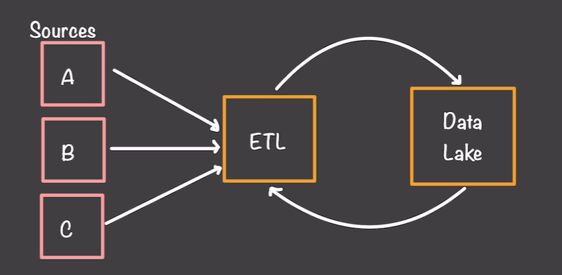
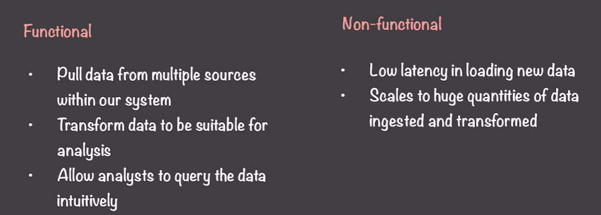
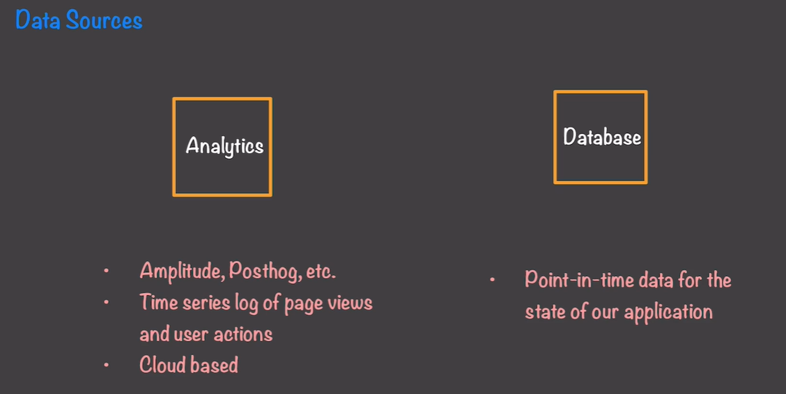
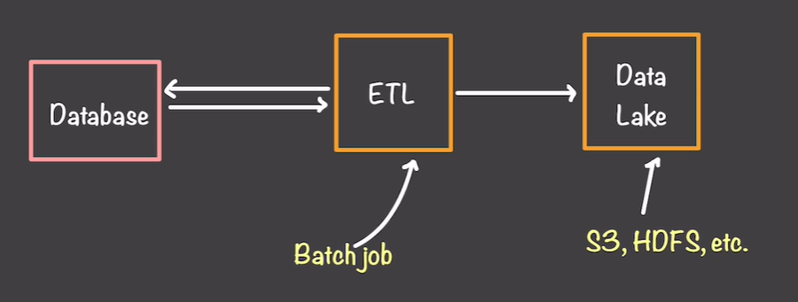

# Design a Data Warehouse | System Design

# first step in desgin the data warehouse thining about actual source of data we have , where they are , what they are using for 

you can see there is two source system one is analytics and other one is database 

## what is the difference between ?

**A. Database — operational/application data**

The application's database stores the current state of the business.

customers

customer_id
name
email

orders

order_id
customer_id
amount
status
created_at

This is generally called an OLTP / operational source.

**B. Analytics source — behavioral/event data**
Now imagine the same website.

a used does this 

Homepage Viewed
Product Searched
Product Viewed
Added To Cart
Removed From Cart
Purchase Completed

The application may send these events to an analytics platform:

**These could be collected by systems such as:**

Amplitude
PostHog
Google Analytics
application event/log systems
Kafka/event streams
cloud logging systems

**Time series log of page views and user action** :- It is basically recording what users did and when they did it.

timestamp            user_id    event

10:01:23             101        page_view
10:01:31             101        product_view
10:02:05             101        add_to_cart
10:04:12             101        purchase

## the ware house combine be like 
                 ┌── PostgreSQL
                 │
                 ├── Amplitude
                 │
                 ├── CRM
                 │
                 ├── Payment API
                 │
                 └── CSV
                       ↓
                 Data Pipeline
                       ↓
                 Data Warehouse
                       ↓
              Business Analytics

# Now connect this to your Data Warehouse design
"**What data do we have**?"

Then:

"**Where does that data live?**"

Then:

"**What does each source contain?**"

Then:

"**Why do we need that data?**"

Then:

"**How can we extract it?**"

You can make a source inventory like:

| Source           | Type           | Contains                 | Purpose                   | Extraction     |
| ---------------- | -------------- | ------------------------ | ------------------------- | -------------- |
| ERPNext MariaDB  | Operational DB | Orders, items, suppliers | Run ERP                   | API/DB         |
| ERPNext REST API | API            | Business entities        | Application access        | REST           |
| Amplitude        | Analytics      | User events              | Behavioral analytics      | API            |
| Kafka            | Event stream   | Real-time events         | Event processing          | Consumer       |
| CSV              | File           | External data            | Manual/external reporting | File ingestion |

# how to increase the latency 

if the database have huge amount of data then single etl  take to much time to complerte  so

**what is the solution :-** spark cluster (horiozntal scaling etl pipeline )

spark :- which is distributed data processing framewrok . when you run code in the spark it is  divide the task by mutliple machine 

# ingestion 

## question :- Every time the pipeline runs, how do we know which records need to be loaded?

There are four approaches here. They are basically progressing from **simple but expensive → more efficient** → **more reliable incremental ingestion.**

1. Load the entire database every time

Every day:

Source DB
   ↓
Read ALL 10 million rows
   ↓
Data Lake

And add:

ingested_at = 2026-08-11

So tomorrow you again load all 10 million:

**Problem**

Massive duplication.

If only 1,000 records changed, you're still moving 10 million records.

So:

Data changed:       1,000
Data processed:     10,000,000

Terrible at scale.

