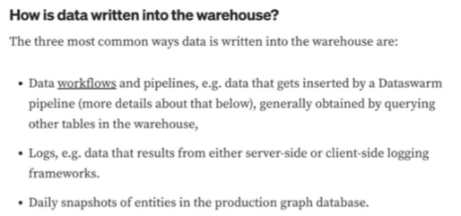
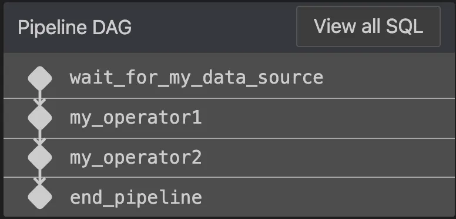
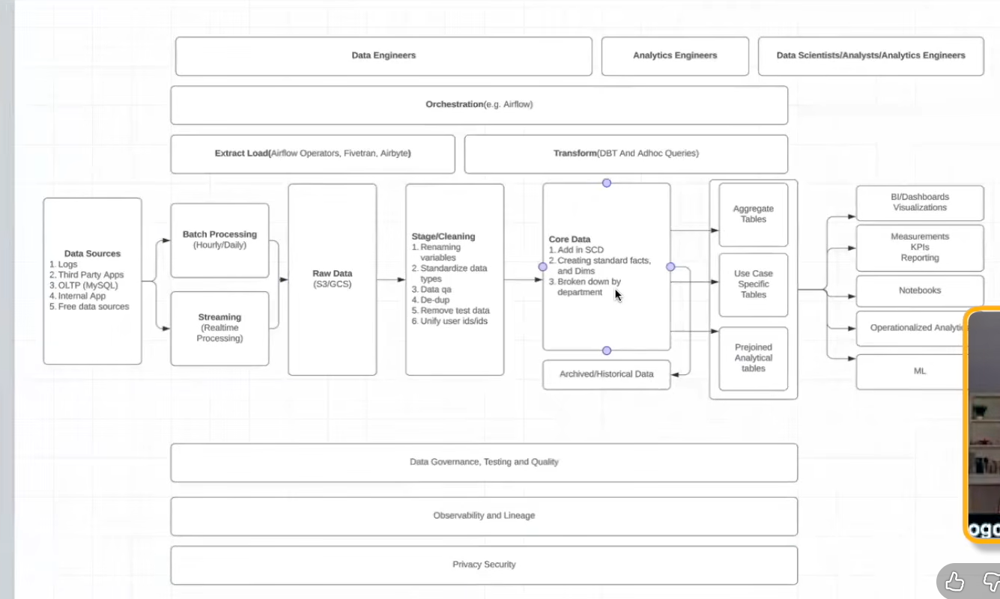
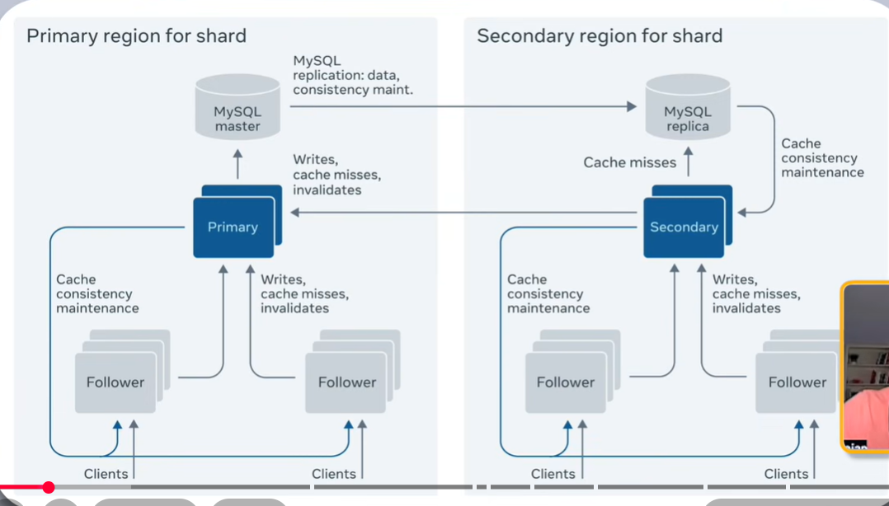
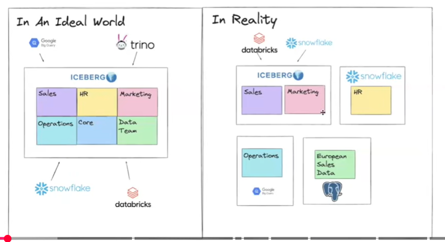

# Building Data Pipelines At Facebook - How To Manage An Exabyte Data Warehouse (Data engineering at Meta: High-Level Overview of the internal tech stack)

# problem 1 Data Locality & Distributed Data Management

Sure. The problem is basically **data is spread across different physical locations**.

Imagine Facebook's warehouse is not one building. It is like:

**India data center** → some tables
**USA data center** → some tables
**Europe data center** → some tables

Now suppose a query needs data from different places.

If the data is scattered randomly, the system has to **move huge amounts of data between locations**. That is slow and expensive.

## Facebook's solution: Namespaces

They group related tables together in the **same location**.

For example:

```text
Namespace: User Data
   ├── users
   ├── user_profiles
   └── user_activity

Namespace: Ads Data
   ├── ads
   ├── ad_clicks
   └── ad_impressions
```

So if a query needs **User Data**, the related tables are already close together.

## Simple idea

❌ **Without namespaces**

`Data A (USA) ←→ Data B (Europe) ←→ Data C (India)`

Lots of data movement → **slow**

✅ **With namespaces**

`User tables → USA`

`Ads tables → Europe`

Related data stays together → **less data movement → faster queries**

**Without good data placement:**

users → India
profiles → Canada
activity → USA

Query
  ↓
Move data between locations
  ↓
Expensive

**With good placement:**

User namespace → India

users
profiles
activity
   ↓
Query locally

### The key problem

> **How do we organize a huge distributed warehouse so that queries don't have to constantly move massive amounts of data between different locations?**

That's the important system-design idea here: **physical + logical partitioning to reduce data movement.**


Problem: Cross-Namespace Data Access

Data is owned/stored in different namespaces, but a query needs tables from multiple namespaces.

Namespace A
  └── Table A

Namespace B
  └── Table B

Query needs:
Table A + Table B
       ❌


Solution: Cross-Namespace Replication

Create a synchronized replica of one table in the other namespace.

Namespace A
  ├── Table A
  └── Table B (replica)  ←──── Namespace B

Now the query can run where both tables exist.

What is it called?

Cross-namespace table replication

You can also describe the underlying idea as:

Data replication — copying data to another location
Data synchronization — keeping the copy updated
Data locality — putting required data close to the workload
Cross-namespace querying — the problem being addressed

For your system-design notes, I'd write:

Problem: Cross-namespace data access
Solution: Cross-namespace table replication with automatic synchronization.

# problem 2 Large-Scale Data Scanning & Partitioning
A data warehouse table can contain **billions or trillions of rows**.

If a query asks for only recent data, the system would have to scan a huge amount of unnecessary data.

For example:

```text
posts table
├── 2026-08-08 → millions of rows
├── 2026-08-09 → millions of rows
├── 2026-08-10 → millions of rows
└── ... → years of data
```
---------------------------------------------------------------------------------------------------------

Query:

```sql
WHERE ds = '2026-08-10'
```

Without partitioning, the system may need to scan a large portion of the table.

--------------------------------------------------------------------------------------------------------

### Solution

**Partition the table** using a column such as `ds` (date).

```text
posts
├── ds=2026-08-08
├── ds=2026-08-09
└── ds=2026-08-10
```

When the query asks for:

```sql
WHERE ds = '2026-08-10'
```

the system can **skip the other partitions** and read only the required one.

This is called **partition pruning**.

-------------------------------------------------------------------------------------------------------------------

### Result

**Less data scanned → faster queries → lower compute/storage-processing cost.**

**Problem:** Huge tables cause expensive and slow scans.
**Solution:** Partition tables so the system can skip irrelevant data (**partition pruning**).

**you can more than 1 partion columns**

In real data warehouses/data lakes, a partition is a logical grouping of data, and that partition may contain one or many physical files.

TABLE
  ↓
PARTITIONS
  ↓
FILES

In a data warehouse

Imagine:

posts table
│
├── Partition: ds=2026-08-09
│      ├── file1.parquet
│      ├── file2.parquet
│      └── file3.parquet
│
└── Partition: ds=2026-08-10
       ├── file4.parquet
       ├── file5.parquet
       └── file6.parquet

Here:

Partition = logical organization/grouping.

File = actual physical data stored on disk/object storage.

-----------------------------------------------------------------------------------------------------------------

**Why multiple files?**

Because the data could be huge.

Suppose ds=2026-08-10 contains 10 TB of data.

You don't want one gigantic 10-TB file.

You might split it:

2026-08-10 partition
│
├── 1 GB file
├── 1 GB file
├── 1 GB file
├── ...
└── 1 GB file

Now many workers can read different files in parallel.

Worker 1 → file 1
Worker 2 → file 2
Worker 3 → file 3
Worker 4 → file 4

That's much better for large-scale processing.

---------------------------------------------------------------------------------------------------------------------------

# Data Retention

**Problem**

Data continuously grows over time. If we keep all data forever, storage becomes expensive and the system has to manage a huge amount of unnecessary old data.

**Solution**

Use a data retention policy that defines how long data should be kept.

For example, if a table has a 90-day retention period:

New data ───────────────→ 90 days
                              ↓
                       Retention limit
                              ↓
                    Archive or Delete

When a partition becomes older than 90 days, the system automatically:

Deletes it if it is no longer needed, or
Archives it to cheaper cold storage if it may be needed later.
Key Concept

Data Retention = Automatically controlling how long data remains in the system.

-----------------------------------------------------------------------------------------------------

# Data Ownership and On-Call

### Problem

When there is a problem with a table, it can be unclear:

* **Who owns this data?**
* **Who should fix the problem?**
* **Who should answer questions about the data?**

For example:

```text
Table: user_orders

Something is wrong
       ↓
Who should we contact? ❓
```
---------------------------------------------------------------------------------------------------

### Solution

Every table is assigned to an **on-call group**.

The on-call group identifies the **team responsible for that data**.

```text
user_orders
     ↓
On-call group
     ↓
Data Engineering Team
     ↓
Responsible for the table
```

If someone finds incorrect data or has a question, they know **exactly which team to contact**.

----------------------------------------------------------------------------------------------------

### Key Concept

**On-call group = The team responsible for a dataset and the first point of contact when there is a problem or question.**

---------------------------------------------------------------------------------------------------------------------------------

# How does data get INTO the warehouse?



Think of the **data warehouse as a big central storage place**.

Different kinds of data need to enter that warehouse. The image gives **3 common ways**.

--------------------------------------------------------------------------------------------------------------

## 1. Data Workflows / Pipelines

This means a **program/pipeline collects or calculates data and writes it into the warehouse**.

Example:

```text
Facebook tables
      ↓
Data pipeline
      ↓
Data Warehouse
```

Suppose Facebook already has:

```text
users
posts
likes
```

A pipeline might calculate:

> "How many likes did each user receive yesterday?"

Then it writes the result into:

```text
user_daily_likes
```

So:

**Pipeline = code/workflow that moves or transforms data and puts it into the warehouse.**

-------------------------------------------------------------------------------------------------------------

## 2. Logs

Applications generate **logs** whenever users or systems do something.

For example, when you use Facebook:

```text
You open Facebook
      ↓
You click a post
      ↓
You like it
      ↓
You watch a video
```

The application can generate events/logs:

```text
user_id = 123
event = "like"
post_id = 456
time = 10:32
```

Those logs can eventually be written into the warehouse:

```text
Application
     ↓
Logs / Events
     ↓
Warehouse
```

----------------------------------------------------------------------------------------------------------------------

The image mentions two types:

**Server-side logging** → event is recorded by Facebook's backend.

**Client-side logging** → event is recorded by the app/browser/device.

-------------------------------------------------------------------------------------------------------------------------

## 3. Daily Snapshots

This one is different.

A **snapshot means taking a picture of the current state of something at a particular time**.

Imagine Facebook has a production database containing users:

```text
user_id | name | country
1       | John | USA
2       | Alex | India
```

Every night, they can copy the current state into the warehouse:

```text
Snapshot: August 10

user_id | name | country
1       | John | USA
2       | Alex | India
```

Tomorrow:

```text
Snapshot: August 11

user_id | name | country
1       | John | Canada
2       | Alex | India
3       | Mike | UK
```

Now you can compare:

```text
August 10 → What did the data look like?
August 11 → What changed?
```

-------------------------------------------------------------------------------------------------------------------------------------------

## So remember these 3

```text
             DATA WAREHOUSE
                   ↑
        ┌──────────┼──────────┐
        │          │          │
    Pipelines     Logs     Snapshots
        │          │          │
   Processed    Events     Daily copy
      data       /logs      of state
```
-----------------------------------------------------------------------------------------------------------------------------------

### In your Problem → Solution format:

**Problem:** The warehouse needs data from many different sources and systems.

**Solution:** Data is written into the warehouse through **data pipelines, application logs, and periodic snapshots**.

That's what this whole section is trying to explain.

-----------------------------------------------------------------------------------------------------------------------------------

## what is data swarm ?

What is DataSwarm?

DataSwarm is a data workflow/pipeline system developed at Facebook (Meta).

Its job is to automate data pipelines.

Think of it like:

Source Tables
     ↓
DataSwarm Pipeline
     ↓
Process / Transform Data
     ↓
Warehouse Table

DataSwarm = a system for defining and automatically running data workflows/pipelines that produce data in the warehouse.

----------------------------------------------------------------------------------------------------------------------------------

# Writing Data Pipelines

**The blog means:**

SQL = Business logic
→ SQL defines what data to calculate/transform.

Python = Orchestration
→ Python controls when and in what order the SQL runs.

--------------------------------------------------------------------------------------------------------------

## Real-life example: Facebook daily post analytics

Imagine Facebook wants a table containing:

How many likes each post received every day.

Facebook already has a huge table:

posts

post_id
user_id
created_at

and:

likes

user_id
post_id
liked_at

They want to create:

daily_post_likes

date
post_id
like_count

--------------------------------------------------------------------------------------------------------------------------

2. SQL does the business logic

The actual calculation can be written in SQL:

INSERT INTO daily_post_likes
SELECT
    DATE(liked_at) AS date,
    post_id,
    COUNT(*) AS like_count
FROM likes
WHERE DATE(liked_at) = CURRENT_DATE
GROUP BY
    DATE(liked_at),
    post_id;

This SQL answers:

What should we calculate?

It says:

Take likes
Take today's likes
Group them by post
Count the likes
Store the result

That's business logic.

-------------------------------------------------------------------------------------------------------------------------------

3. But SQL doesn't manage the whole pipeline

Imagine this needs to happen every day at 2 AM.

You need something to say:

2 AM
 ↓
Check whether source data arrived
 ↓
Run SQL
 ↓
Check whether SQL succeeded
 ↓
Move to next task
 ↓
Notify team if something failed

**That's where Python/orchestration comes in.**

----------------------------------------------------------------------------------------------------------------------------------

4. Python manages the workflow

**A simplified Python example:**

def daily_post_pipeline():

    wait_for_likes_data()

    run_sql("daily_post_likes.sql")

    validate_result()

    notify_success()

Python isn't calculating the number of likes.

It's saying:

"Run this step, then this step, then this step."

-------------------------------------------------------------------------------------------------------------------------------

5. Real pipeline

A real production pipeline might look like:

                Python
                  │
                  ▼
        Check source data
                  │
                  ▼
             Run SQL
                  │
                  ▼
          Validate result
                  │
                  ▼
          Publish table
                  │
                  ▼
          Send notification

**And the SQL might be:**

daily_post_likes.sql

**while Python controls it:**

pipeline.py

-------------------------------------------------------------------------------------------------------------------------------
6. Why separate SQL and Python?

Because they solve different problems.

SQL is good at:
Filtering
JOIN
GROUP BY
Aggregation
Transformation
Calculations

Example:

SELECT
    post_id,
    COUNT(*) AS likes
FROM likes
GROUP BY post_id;
Python is good at:
Scheduling
Dependencies
Retries
Error handling
Calling APIs
Running multiple tasks
Monitoring

For example:

extract_data()
run_sql()
validate_data()
send_alert()

----------------------------------------------------------------------------------------------------------------

## key idea

                 DATA PIPELINE
                      │
          ┌───────────┴───────────┐
          │                       │
        SQL                     Python
          │                       │
   Business Logic            Orchestration
          │                       │
   What to do              When/how to do it
          │                       │
   Transform data           Schedule
   JOIN                     Dependencies
   GROUP BY                 Retries
   Calculate                Monitoring

-----------------------------------------------------------------------------------------------------------------------

# how DataSwarm organizes and runs pipelines

### 1. DataSwarm

At Facebook, **DataSwarm** is a Python library/framework used for:

* **Orchestration** → deciding what runs and in what order.
* **Scheduling** → deciding when it runs.

It was an internal predecessor to **Apache Airflow**.

---

### 2. Pipeline = DAG

DataSwarm represents a pipeline as a **DAG (Directed Acyclic Graph)**.

Don't worry about the name yet. Think of it as a **flow of tasks**:

```text
Get data
   ↓
Clean data
   ↓
Calculate metrics
   ↓
Save result
```

Each box is called an **operator**.

```text
Get data          → Operator 1
Clean data        → Operator 2
Calculate metrics → Operator 3
Save result       → Operator 4
```

The complete flow is the **DAG**.

### 3. Why "directed"?

Because the flow has a direction:

```text
A → B → C
```

B depends on A, and C depends on B.

### 4. Why "acyclic"?

The flow **cannot create a loop**:

```text
A → B → C → A ❌
```

It must move forward:

```text
A → B → C → D ✅
```

### Key idea

> **DataSwarm uses Python to define and schedule a DAG, and each operator represents one task in that pipeline.**

This is basically the same core idea you'll see later with **Airflow DAGs and operators**.

# different types of operators in DataSwarm 

Remember:

> **Operator = one task/step in a pipeline.**

For example:

```text
Wait → Query → Check → Transfer → Notify
```

Each step is an operator.

### 1. WaitFor Operator

**Purpose:** Wait until required data arrives.

Example:

```text
Wait for today's likes data
          ↓
Data arrives
          ↓
Continue pipeline
```

It prevents the next task from running before the required data is available.

---

### 2. Query Operator

**Purpose:** Run SQL/query on the warehouse.

Example:

```sql
SELECT post_id, COUNT(*)
FROM likes
GROUP BY post_id;
```

The operator can run this using engines such as **Presto or Spark**.

---

### 3. Data Quality Operator

**Purpose:** Check whether the data is correct.

For example:

```text
Check:
✓ No NULL user_id
✓ No duplicate IDs
✓ Row count > 0
✓ Valid dates
```

If the check fails:

```text
Pipeline
   ↓
Quality Check ❌
   ↓
STOP / ALERT
```

---

### 4. Data Transfer Operator

**Purpose:** Move data from one system to another.

```text
System A
   ↓
Transfer Operator
   ↓
System B
```

For example, move processed data from one storage system to another.

---

### 5. Miscellaneous Operators

These handle other tasks that don't fit the above categories.

Examples:

```text
Send email
Send chat notification
Call an API
Run a Python script
```

---

### Real pipeline example

A Facebook-style daily pipeline could be:

```text
WaitFor
"Is today's likes data available?"
        ↓
Query
"Calculate daily likes"
        ↓
Data Quality
"Is the result valid?"
        ↓
Data Transfer
"Move result to analytics table"
        ↓
Miscellaneous
"Notify team that pipeline finished"
```

So the big idea is:

> **DataSwarm provides different operators as building blocks, and you connect those operators to create a complete DAG/pipeline.**

# **Predecessor = something that came before and influenced/replaced by something newer.**

So when the blog says:

> **DataSwarm is a predecessor to Airflow**

It means:

```text
DataSwarm
   ↓
Earlier system
   ↓
Airflow
   ↓
Newer/generalized system
```

Facebook built **DataSwarm first** to orchestrate pipelines. Later, **Airflow** was developed with similar core ideas like **DAGs, operators, scheduling, and dependencies**.

So simply:

> **DataSwarm was an earlier system whose ideas came before Airflow.**

# code example 
Yes bro. This code is showing a **simple DataSwarm pipeline with 3 steps**.

Think of it as:

```text
Wait for data
     ↓
Process data → staging table
     ↓
Process again → final table
```

## 1. Schedule the pipeline

```python
config.set(schedule="@daily")
```

This means:

> Run this pipeline **once every day**.

---

## 2. Wait for today's data

```python
wait_for_my_data_source = WaitForPartitionOperator(
    table="my_data_source",
    partition="ds=<DATEID>"
)
```

This operator says:

> **Don't start processing until today's data has arrived in `my_data_source`.**

For example:

```text
my_data_source
     ↓
ds=2026-08-10  ← Is it available?
     ↓
YES → continue
NO  → keep waiting
```

This is important because the pipeline shouldn't process data that hasn't arrived yet.

---

## 3. First processing step

```python
my_operator1 = PrestoOperator(
    dep_list=[wait_for_my_data_source],
```

`dep_list` means **dependency**.

It says:

> `my_operator1` must wait for `wait_for_my_data_source` to finish.

Then:

```sql
SELECT *
FROM my_data_source
WHERE ds='<DATEID>'
```

This SQL performs the **business logic**.

The result is written into:

```python
create="my_staging_table",
partition={"ds": "<DATEID>"}
```

So:

```text
my_data_source
      ↓
  Presto SQL
      ↓
my_staging_table
```

---

## 4. Second processing step

```python
my_operator2 = PrestoOperator(
    dep_list=[my_operator1],
```

Again, dependency.

It says:

> **Don't run operator 2 until operator 1 finishes.**

Then it reads:

```sql
SELECT *
FROM my_staging_table
WHERE ds='<DATEID>'
```

and creates:

```python
create="my_table"
```

So the complete pipeline is:

```text
WaitForPartition
       ↓
my_data_source
       ↓
PrestoOperator 1
       ↓
my_staging_table
       ↓
PrestoOperator 2
       ↓
my_table
```

### The most important thing to understand

There are **two different concepts here**:

**Python/DataSwarm:**

```text
What runs first?
What depends on what?
When should it run?
```

**SQL:**

```text
What should happen to the data?
```

So this example perfectly demonstrates what we discussed earlier:

> **Python/DataSwarm = orchestration**
> **SQL/Presto = business/data transformation logic**.

<!-- Presto is a distributed SQL query engine.

It lets you use SQL to query very large amounts of data stored across systems like data lakes and warehouses. -->

##  Our internal VSCode extensions process the pipeline definition on save and calculate the DAG:


If there is an error in any of the SQL statements, the custom linter will display a warning before even trying to run the pipeline. The same extensions also allow the data engineers to **schedule a test run of the new version using real input data**, writing the output to a temporary table.

<!-- The linter checks the SQL before the pipeline runs: -->

# upm :- advanced pipeline features 
Normally: Engineers manually tell the pipeline what data it must wait for.

Example:

Operator 1 → wait for source partition
Operator 2 → wait for Operator 1

But the SQL already tells us this:

WHERE ds = '<DATEID>'

From this, a system can understand:

“This query needs the <DATEID> partition of this table.”

So Meta built UPM (Unified Programming Model) to automatically analyze the SQL and infer these dependencies.

Without UPM

my_operator1 = PrestoOperator(
    dep_list=[wait_for_my_data_source],
    sql="""... FROM my_data_source
            WHERE ds='<DATEID>' ..."""
)

my_operator2 = PrestoOperator(
    dep_list=[my_operator1],
    sql="""... FROM my_staging_table
            WHERE ds='<DATEID>' ..."""
)

You manually tell the system:

operator1 → wait for my_data_source
operator2 → wait for operator1

So you explicitly write dep_list.

With UPM
config.set(schedule="@daily", use_upm=True)

my_operator1 = PrestoOperator(
    sql="""... FROM my_data_source
            WHERE ds='<DATEID>' ..."""
)

my_operator2 = PrestoOperator(
    sql="""... FROM my_staging_table
            WHERE ds='<DATEID>' ..."""
)
Now you remove dep_list.

UPM = “Look at my SQL and automatically figure out what data this pipeline needs before running.”


# Presto and Spark: Querying the warehouse
### Presto and Spark: Querying the warehouse

This section is basically about **how Meta processes data stored in its data warehouse**.

* **Presto** → mainly used to run SQL queries interactively and quickly.
* **Spark** → mainly used for large-scale data processing and more complex transformations.
* Both can **read data from the warehouse** and process it.
* The choice depends on the type and scale of the workload.

For your Data Engineering preparation, understand the basic difference:

> **Presto = SQL query engine**
> **Spark = distributed data processing engine**

This paragraph gives you the **real-world reason for choosing Presto vs Spark**.

### What you should remember

| Presto                            | Spark                                 |
| --------------------------------- | ------------------------------------- |
| Mainly SQL queries                | Heavy data processing                 |
| Usually faster for normal queries | Better for complex/heavy workloads    |
| Good for ad-hoc analysis          | Good for expensive joins              |
| Lower memory requirement          | Can handle higher memory requirements |

### Important point

At Meta, engineers **mostly write SQL**:

* Presto SQL
* Spark SQL

They can also use **Python, Java, Scala APIs** with Spark when transformations become more complex.

### Real-world example

Suppose you need:

**Simple query:**

```sql
SELECT country, COUNT(*)
FROM users
GROUP BY country;
```

→ **Presto** is usually a good choice.

**Very heavy processing:**

```text
Huge datasets
+ multiple expensive JOINs
+ complex transformations
+ high memory requirement
```

→ **Spark** is more suitable.

### One important Meta-scale point

They say scanning **a few billion rows** can still be considered a **light query at Meta scale**.

You don't need to memorize that number. The important lesson is:

> **Tool choice depends on workload, not simply on the amount of data.**

For your preparation, this level is enough.


## With Spark, Python, Java, and Scala are programming languages used to control Spark.

Think of it like this:

Python / Java / Scala
        ↓
    Spark API
        ↓
   Spark Engine
        ↓
Distributed processing

Why use Python/Java/Scala?

<!-- SQL is excellent for normal transformations.

Programming APIs become useful when you need: -->

Complex transformation logic
Loops/conditions
Custom functions
More control over processing
Integration with other applications

# conclusion 


Overall flow

Data Sources
    ↓
Batch / Streaming
    ↓
Raw Data
    ↓
Stage / Cleaning
    ↓
Core Data
    ↓
Analytical Tables
    ↓
BI / ML / Analytics

# depth explantion 
Table of Contents

We will understand the diagram in 8 steps:

Data Sources — where data comes from
Batch & Streaming — how data enters the platform
Raw Data — why raw data is stored
Stage/Cleaning — cleaning and standardization
Core Data — creating reliable business data
Analytical Tables — preparing data for users
Consumers — dashboards, ML, analytics
Cross-cutting layers — governance, quality, lineage, security


## data sources 
Example

Imagine an e-commerce company.

Data might come from:

Website
   ↓
User clicks → Logs

Payment system
   ↓
Transactions → OLTP database

Marketing platform
   ↓
Campaign data → Third-party app

Company application
   ↓
Employee/customer data → Internal app

<!-- The Data Engineer's job starts when this data needs to be brought into the data platform. -->

The source system is designed primarily to run the application.

The data platform is designed primarily to store, process, and analyze data.

## batch and streaming 

| Batch            | Streaming        |
| ---------------- | ---------------- |
| Periodic         | Continuous       |
| Higher latency   | Low latency      |
| Easier to manage | More complex     |
| Daily reports    | Real-time alerts |

<!-- Real-world reality -->

Streaming sounds better because it's "real-time", but you don't use streaming everywhere.

It is more expensive and operationally more complicated.

If a business only needs a report once per day, batch processing is usually enough.

--------------------------------------------------

## Raw data 

After data enters the platform through batch or streaming, it is stored as Raw Data.

Data Sources
     ↓
Batch / Streaming
     ↓
Raw Data (S3/GCS)

**The raw layer keeps this information largely as received.**

-------------------------------------------------------------

**Why keep raw data?**

1. Backup / recovery

If your cleaning logic has a bug, you can go back to the original data.

2. Reprocessing

Suppose tomorrow you change your transformation logic.

You can take the raw data and process it again.

3. Auditability

You can answer:

"Where did this data originally come from?"

-----------------------------------------------------------

**S3 / GCS**

The diagram mentions:

S3 → Amazon's object storage
GCS → Google Cloud Storage

These are commonly used to store large amounts of data cheaply.

## Stage / Cleaning

1. Rename variables

Different sources may use different names:

cust_id
customerID
customer_id

We standardize them to something like:

customer_id

2. Standardize data types

3. Data Quality

4. Remove duplicates
5. Remove test data
6. Unify user IDs
**Different systems might identify the same person differently:**

System A → user_123
System B → customer_987

The data platform may map them to a common identifier.

---------------------------------------------------------------
**Reality check**

Cleaning is often one of the biggest parts of real Data Engineering work.

It is not just:

"Load data → transform data → done."

Real source data is messy, inconsistent, and constantly changing.

Core idea:

The staging layer prepares raw data so downstream systems can safely use it.

## core data 
Core Data is where cleaned data becomes trusted business data.

**What happens here?**

We organize the data into useful business concepts.

**Example**
**
Suppose two systems provide customer information:**

CRM:
customer_id = 101
name = Lakhan

Website:
user_id = 101
country = India

Core Data can combine these into:

customer_id | name   | country
101         | Lakhan | India

Now different teams can use a consistent definition of a customer.

**Facts and Dimensions**

You may see these terms frequently in Data Engineering:

**Reality check**

This layer is where **business logic becomes important.**

The difficult part isn't just SQL. Engineers need to understand:

What does this data actually mean?
Which definition is correct?
How should different sources be combined?
What should happen when data conflicts?

Core idea:

Core Data = cleaned data organized around reliable business concepts and definitions.

## analytical tables 
Now we have trusted Core Data.

The next step is to **make data easy and efficient for specific users and use cases.**

Core Data
    ↓
Analytical Tables

---------------------------------------------
**What happens here?**

We create tables specifically designed for analysis.

**For example, Core Data might contain detailed orders:**

order_id
customer_id
product_id
price
quantity
date

**An analytical table might prepare:**

date
country
total_orders
total_revenue

Now a dashboard can query it much faster.

### three common things 
1. Aggregation

Turn detailed data into summaries.

10 million orders
       ↓
daily revenue by country

2. Pre-joining

Frequently used tables can be joined beforehand.

orders + customers + products
            ↓
   analytical table

3. Use-case specific tables

Different teams may need different tables.

Marketing → campaign performance
Finance   → revenue
Product   → user engagement


### Why?

Instead of making every analyst perform expensive transformations every time:

Raw/Core data
     ↓
complex JOIN + GROUP BY
     ↓
dashboard

we prepare the data once:

Core Data
    ↓
Analytical Table
    ↓
Dashboard

### Reality check

This creates a trade-off:

Faster queries + easier analysis

but

More tables + more storage + more pipelines to maintain.

### Core idea:- Analytical tables are prepared versions of core data optimized for specific analytical needs.

## Consumers

Now the prepared Analytical Tables are used by the people and systems that need the data.

Analytical Tables
        ↓
   Consumers

### which types of consumer are ?
1. BI / Dashboards
2. KPIs / Reporting
3. Notebooks
4. Machine Learning


### core idea :- Data Engineering ultimately exists to make reliable data available to people and systems that create business value.

## Cross-Cutting Layers

These are the things that apply across the entire pipeline, not just one stage.

             Governance
             Testing
             Quality
             Lineage
             Observability
             Privacy
             Security
                  ↓
Source → Raw → Clean → Core → Analytical → Consumers

## they are  

1. Data Quality

Checks whether data is correct.

2. Data Lineage

Tracks where data came from and where it goes.

3. Observability

Monitors whether pipelines are working.

For example:

Pipeline failed
↓
Alert Engineer

4. Governance
Defines rules around how data should be managed and used.

5. Privacy & Security
Controls who can access sensitive data

### Reality check

These aren't optional "extra features" in a serious data platform.

At small scale, teams may handle them simply.

At large companies like Meta, they become critical infrastructure because millions/billions of records and many teams depend on the data.

### Core idea:- A production data pipeline needs not only processing, but also quality, monitoring, lineage, governance, and security.

# additional 
# additonal 01 


## problems 
### Problem 1: Primary region failure 💥

**Problem:** If the primary region goes down, the data/service could become unavailable.

**Solution:** Keep a replicated copy of the shard in a **secondary region**. If the primary fails, the secondary can take over.

---

### Problem 2: Users are far away from the primary region 🌍

**Problem:** Users in Europe or Asia would have to communicate with a database in the US, causing higher latency.

**Solution:** Keep replicas in different geographic regions so users can access data **closer to them**.

---

### Problem 3: Too many read requests 🚦

**Problem:** Millions of users may request the same data. Sending every request directly to MySQL would overload it.

**Solution:** Use **caches and followers** to distribute read traffic and reduce the load on MySQL.

---

### Problem 4: Database reads are slow 🐌

**Problem:** Going to MySQL for every request takes more time.

**Solution:** Store frequently requested data in **cache**, allowing fast reads.

---

### Problem 5: Cache contains old data ❌

**Problem:** When data changes in MySQL, the old value may still exist in the cache.

**Solution:** **Invalidate/update the cache** when a write happens so users don't receive stale data.

---

### Problem 6: One region cannot handle everything 📈

**Problem:** Facebook operates globally with enormous traffic. One region shouldn't have to handle all requests.

**Solution:** Distribute data and traffic across **multiple regions, replicas, caches, and followers**.

---

### 🎯 The main idea

**Problem:** Facebook needs to serve enormous global traffic while keeping data available and fast.

**Solution:**
**Replication + multiple regions + caching + followers**

That's the core architecture.

# additonal 02 


## problem 01 
This image is showing a very common **data architecture problem**:

> **In theory, you want one central data platform. In reality, data gets scattered across different systems.**

### 1. In an ideal world

Imagine the company has one central **Apache Iceberg** data platform.

Inside it:

```text
                 ICEBERG
        ┌─────────────────────┐
        │ Sales │ HR │ Marketing│
        │ Ops   │ Core │ Data   │
        └─────────────────────┘
```

All departments put their data into the **same platform**.

Then different tools can access that same data:

* Google BigQuery
* Trino
* Snowflake
* Databricks

So you have:

> **One data storage layer → many tools can use it.**

That's the dream.

---

### 2. In reality 😅

The data doesn't stay in one place.

Instead:

```text
Iceberg
 ├── Sales
 └── Marketing

Snowflake
 └── HR

BigQuery
 └── Operations

PostgreSQL
 └── European Sales
```

Now the company has **data silos**.

For example, suppose you want:

> **Total sales + HR employee information + European operations**

You may need to query:

```text
Iceberg
   +
Snowflake
   +
BigQuery
   +
PostgreSQL
```

That's much more complicated.

---

### Why does this happen?

Different teams have different needs.

For example:

**HR team** might already use Snowflake.

**Operations team** might have data in BigQuery.

**European team** might have an old PostgreSQL database.

**Data team** might use Iceberg/Databricks.

Nobody wants to immediately migrate everything.

So over time:

```text
New team → new tool
Old system → stays
Acquisition → brings another system
Business requirement → another database
```

And eventually you get **data fragmentation**.

---

### 🎯 The actual system-design problem

**Problem:**

> Data is spread across multiple storage systems and platforms, making it difficult to access, combine, govern, and analyze data consistently.

**Ideal solution:**

> Have a common data layer, such as Iceberg, where data is organized centrally while different compute/query engines can access it.

### The important concept for you

This image is really teaching:

**Centralized data layer vs. data silos**

## system desgin question 

And this becomes an important **system-design trade-off**:

> **How do we allow different teams and tools to work independently without creating a mess of disconnected data?**

Bro, the answer is basically **“separate storage from compute.”** This is one of the most important ideas in modern data architecture.

### Problem

Different teams want to use different tools:

* Analytics → Snowflake
* Data engineering → Databricks
* SQL users → Trino
* Other workloads → BigQuery

If every tool has its **own copy of the data**, you get:

> duplicate data + inconsistent data + expensive movement + difficult governance.

### Solution

Create **one common data/storage layer** and let different tools access it.

For example:

```text
                DATA STORAGE
             Apache Iceberg
                    │
        ┌───────────┼───────────┐
        ↓           ↓           ↓
     Trino      Databricks   Snowflake
        ↓           ↓           ↓
      Team A      Team B      Team C
```

The key is:

> **Teams can choose their own compute/query tool, but they don't need to create their own separate copy of the data.**

### But how?

Apache Iceberg acts as the **common table/storage layer**.

It manages things like:

* Where the data files are
* Table schema
* Partitions
* Metadata
* Table versions
* Transactions

Then different engines can understand and work with those tables.

So:

```text
             One Data Layer
                  ↓
      ┌───────────┼───────────┐
      ↓           ↓           ↓
    Trino     Databricks   Snowflake
```

### The important architecture principle

**Don't force every team to use the same compute engine.**

Instead:

> **Standardize the data layer, but allow flexibility in the compute layer.**

That's how you get both:

**Team independence + centralized data management.**

This is exactly why technologies like **Apache Iceberg** are important in modern data platforms.


# additional 03 
